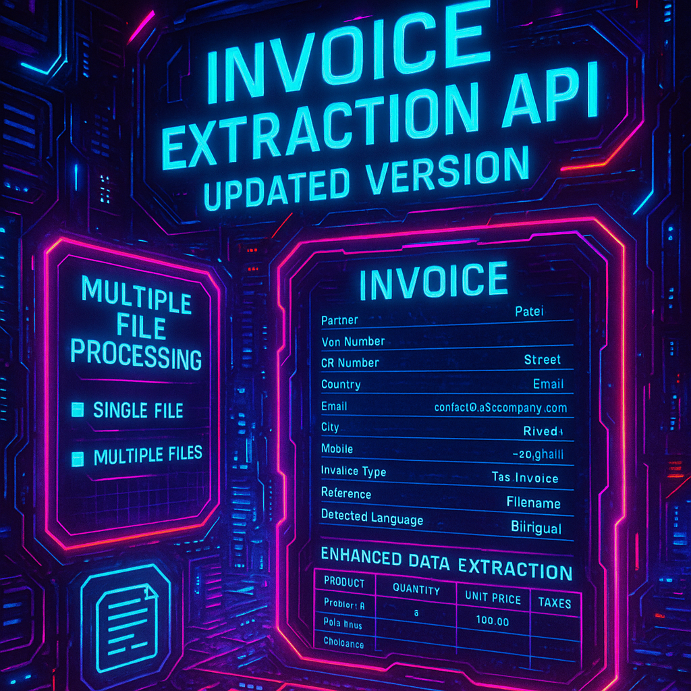

# Invoice Extraction API - Updated Version


This updated version of the Invoice Extraction API now supports multiple file processing and extracts additional invoice details.

## 🆕 New Features

### Multiple File Processing

- **Single File**: `/extract` endpoint (same as before)
- **Multiple Files**: `/extract-multiple` endpoint (new)

### Enhanced Data Extraction

The API now extracts the following fields from invoice documents:

| Field               | Description                                                   |
| ------------------- | ------------------------------------------------------------- |
| `partner`           | Client/customer/partner name                                  |
| `vat_number`        | VAT registration number                                       |
| `cr_number`         | Commercial Registration number                                |
| `street`            | Primary address line                                          |
| `street2`           | Secondary address line                                        |
| `country`           | Country name                                                  |
| `email`             | Email address                                                 |
| `city`              | City name                                                     |
| `mobile`            | Phone/mobile number                                           |
| `invoice_type`      | Type of invoice (e.g., "Invoice", "Tax Invoice")              |
| `invoice_bill_date` | Invoice date (DD/MM/YYYY format)                              |
| `reference`         | Invoice number or reference                                   |
| `invoice_lines`     | Array of line items with product, quantity, unit_price, taxes |
| `detected_language` | Detected language ("Arabic", "English", or "Bilingual")       |
| `filename`          | Source filename (for tracking)                                |

## 📋 API Endpoints

### 1. Single File Extraction - `POST /extract`

Extract invoice data from a single PDF file.

**Request:**

```bash
curl -X POST "http://localhost:8000/extract" \
  -H "accept: application/json" \
  -H "Content-Type: multipart/form-data" \
  -F "pdf=@invoice.pdf"
```

**Response:**

```json
{
  "partner": "ABC Company Ltd",
  "vat_number": "123456789",
  "cr_number": "CR987654321",
  "street": "123 Business Street",
  "street2": "Suite 456",
  "country": "Saudi Arabia",
  "email": "contact@abccompany.com",
  "city": "Riyadh",
  "mobile": "+966501234567",
  "invoice_type": "Tax Invoice",
  "invoice_bill_date": "15/03/2024",
  "reference": "INV-2024-001",
  "invoice_lines": [
    {
      "product": "Product A",
      "quantity": "2",
      "unit_price": "100.00",
      "taxes": "15.00"
    }
  ],
  "detected_language": "Bilingual",
  "filename": "invoice.pdf"
}
```

### 2. Multiple File Extraction - `POST /extract-multiple`

Extract invoice data from multiple PDF files in a single request.

**Request:**

```bash
curl -X POST "http://localhost:8000/extract-multiple" \
  -H "accept: application/json" \
  -H "Content-Type: multipart/form-data" \
  -F "pdfs=@invoice1.pdf" \
  -F "pdfs=@invoice2.pdf" \
  -F "pdfs=@invoice3.pdf"
```

**Response:**

```json
{
  "invoices": [
    {
      "partner": "ABC Company Ltd",
      "vat_number": "123456789",
      // ... other fields
      "filename": "invoice1.pdf"
    },
    {
      "partner": "XYZ Corporation",
      "vat_number": "987654321",
      // ... other fields
      "filename": "invoice2.pdf"
    }
  ],
  "total_processed": 3,
  "successful_extractions": 2,
  "failed_extractions": 1
}
```

### 3. Health Check - `GET /health`

Check if the API is running.

**Response:**

```json
{
  "status": "healthy"
}
```

### 4. API Information - `GET /`

Get API information and available endpoints.

## 🚀 Quick Start

1. **Install Dependencies:**

   ```bash
   pip install -r requirements.txt
   ```

2. **Set Environment Variables:**
   Create a `.env` file with your Gemini API key:

   ```
   GEMINI_API_KEY=your_api_key_here
   ```

3. **Start the Server:**

   ```bash
   uvicorn main:app --reload --host 0.0.0.0 --port 8000
   ```

4. **Test the API:**
   ```bash
   python test_multiple_files.py
   ```

## 🧪 Testing

Use the provided `test_multiple_files.py` script to test both single and multiple file processing:

1. Edit the `sample_files` list in the script with paths to your PDF files
2. Uncomment the test function calls
3. Run the script:
   ```bash
   python test_multiple_files.py
   ```

## 📊 Invoice Line Items

Each invoice line item contains:

- **product**: Product or service name
- **quantity**: Quantity ordered/sold
- **unit_price**: Price per unit
- **taxes**: Tax amount for the line item

## 🔧 Technical Changes

### Model Updates

- Replaced old `Item` model with `InvoiceLine` model
- Updated `InvoiceData` model with new field structure
- Added `MultipleInvoicesResponse` model for batch processing

### Pipeline Enhancements

- Added `process_multiple()` method for batch processing
- Enhanced error handling and logging
- Improved data combining logic for multi-page documents

### API Improvements

- New `/extract-multiple` endpoint for batch processing
- Updated response models
- Enhanced error handling and validation

## 🔍 Extraction Guidelines

The AI model follows these guidelines for extraction:

1. Extracts text in both English and Arabic where available
2. Uses DD/MM/YYYY format for dates
3. Includes only numeric values for amounts (no currency symbols)
4. Returns empty strings for fields not visible or not applicable
5. Extracts all line items from invoice tables
6. Identifies language as "Arabic", "English", or "Bilingual"

## 🛠️ Development

The codebase structure:

```
InvoiceExtractionAI/
├── main.py                     # FastAPI application
├── models.py                   # Root models file
├── src/
│   ├── models/
│   │   └── models.py          # Pydantic models
│   └── core/
│       ├── invoice_pipeline.py    # Processing pipeline
│       ├── invoice_extractor.py   # AI extraction logic
│       └── image_preprocessor.py  # Image preprocessing
├── test_multiple_files.py     # Test script
└── README_UPDATED.md          # This documentation
```

## 🚨 Important Notes

- All PDF files must be valid and readable
- The API processes each file independently in multiple file requests
- Failed extractions are reported in the response for batch processing
- Temporary files are automatically cleaned up after processing
- Large files may take longer to process

## 🤝 API Usage Examples

### Python with requests:

```python
import requests

# Single file
with open('invoice.pdf', 'rb') as f:
    files = {'pdf': f}
    response = requests.post('http://localhost:8000/extract', files=files)

# Multiple files
files = [
    ('pdfs', open('invoice1.pdf', 'rb')),
    ('pdfs', open('invoice2.pdf', 'rb'))
]
response = requests.post('http://localhost:8000/extract-multiple', files=files)
```

### JavaScript with fetch:

```javascript
// Single file
const formData = new FormData();
formData.append("pdf", pdfFile);
const response = await fetch("/extract", {
  method: "POST",
  body: formData,
});

// Multiple files
const formData = new FormData();
pdfFiles.forEach((file) => formData.append("pdfs", file));
const response = await fetch("/extract-multiple", {
  method: "POST",
  body: formData,
});
```
